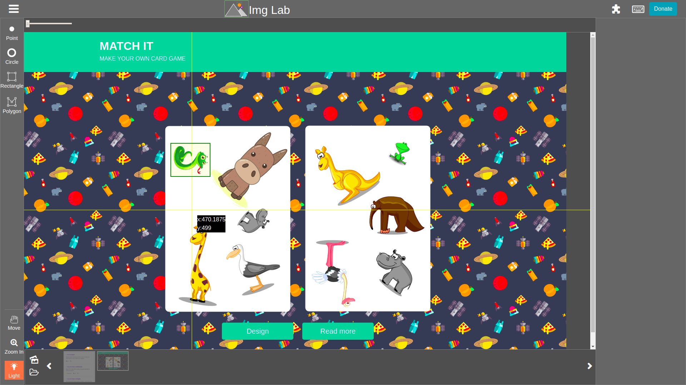

## UI overview



### Components

* **work area** : Middle area where the image is loaded. A transparent SVG is overlayed on that so a shape can be drawn.
* **tool bar** : left bar contains tools to draw shapes and other.
* **action bar** : Each tool may have some extra actions to do. They'll be loaded when a particular tool is selected. It exist just above the workarea.
* **menu bar** : Top bar
  * **Menu** : Drop down list appears on 3 line icon. Currently it contains
    * Open : to load project file or dlib supported XML or pts file
    * Save : export data into various formats
  * **Plugins** : Drop down list appears on puzzle piece icon
    * Plugin window: It opens when you click any item of plugins dropdown
  * **Keyboard shorcuts** : Keyboard icon. It opens a pop up showing key mapping to do an action on key press.
* **thumbnail slider** : In the bottom of the screen with two buttons to import images

## Code overview

### Global variables

* tools : (config.js) It contains the detail of all the tools which should be displayed on toolbar
* labellingData : An object where each key is the name of image loaded into thumbnail slider.
* imgSelected : An object selected image containes it's name, and size detail.
* selectedElements : An array of selected svg.js elements / shapes.
* selectedElement : A svg.js element. currently selected.
* selectedTool : tool detail from *tools* object of selected tool .
* plugins : contains data to draw a  plugin window
* pluginsStore : contains data for plugin
* myCanvas : svg.js SVG object. It can be used to interact any SVG elements in workarea.
* data_schema : not in use yet. It'll be representing the schema of labellingData and will be used to store data in nimn format.
* appConfig : (settings.js) Contains app related settings to avoid hardcoding in the code.

### Global functions

* showSnackBar : use it to display some error message
* getCordinates : return mouse coordinates corresponding to SVG canvas.

### Files

* app.js : define global functions and variables here if they can't be logically grouped to particular js or tag file.
* store.js : to save shape information in labellingData variable.
* storePersistor.js : contains code to sync labellingData with browser cache

### Tag files
All the files inside tags folder are being used to display some UI component on the screen. We're using riot.js for the same. Files end with ".tag.html".

* actionbar.tag.html : Display the actions related to particular action bar.
* workarea.tag.html : To create / delete shapes in /from workarea and attach necessary events like select, resize, drag etc. When a shape is created / deleted, it updates labellingData by calling appropriate function in store.js
* toolbox.tag.html : Do appropriate action when a tool is selected.


### How to add actions for a tool

1. Create a tag file in `tags\actions\ folder. (Check sample files already present)

```html
<action-actionname>
</action-actionname>
```
2. Add a property `actions` against the tool in config.js. (You'll find some already)

```js
actions : [ 'actionname' ]
```
3. Include the tag file that you created in step 1, on v2.html .

### How to add a plugin

1. Add the entry in plugins variable in config.js
```js
var plugins = {
    "pluginname" : {
        title: "Some title to show on pluginwindow",
        tagName: 'plugintagname'
    }
}
```
2. If you need to save some data, it is recommanded to save in plugins store in config.js
```js
var pluginsStore = {
    "plugintagname" : {
      //plugin data
    }
}
```
3. Create a `plugintagname.tag.html` in `tags\plugins` folder
```html
<plugintagname>
</plugintagname>
```

## Overview of riot js framework

Sample tag file
```html
<tagname>
  <style></style>
  <!-- HTML goes here -->
  <script>
    //Java Script related to this tag only.
    //Avoid using IDs to access any component of the same tag
  </script>
</tagname>
```

**Special Variables**

* *this.opts* : It contains the tag attributes

[Short Overview](https://martinmuzatko.github.io/riot-cheatsheet/)

## How and what to test before raising the PR

### File operation
* open image files to load them to thumbnail slider
* open image folders to  load them to thumbnail slider
* open project file from menu
* save project from menu

### Labeling
* upload some images
* draw some shapes
* draw point on the shapes
* load an image bigger than canvas size
* click on some other images in thumbnail slide bar and come back to image to see if everything is working fine
* resize and drag a shape
* try to move shapes using keyboard shortcuts
* try to load images using keyboard shortcuts
* check if thumbnail slider left, right button are working fine

### Error on console
Press F12 key to open the developer's console. Switch to console and check for errors.
